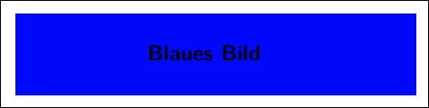

% Viele Ziele
  (Multi Target Publishing)
% Axel Kielhorn
  Babel Fisch (Übers.)
% DTK 2011-3

# Ein Weg führt zu einem Ziel

Bisher war das Ziel meiner Veröffentlichungen immer Papier: DIN A4,
DIN A5 oder auch mal 9 cm $\times$ 12 cm. Auf dem Weg dahin entstand
immer eine PDF-Datei, daher lag es nahe, diese am Bildschirm zu lesen,
was zumindest bei DIN A5 bequem möglich ist.

Doch dann kamen die Mobilgeräte. Einige davon können auch PDF anzeigen
und mit etwas Aufwand kann man den Text so formatieren, das er auf
*einem* Mobilgerät mit wenig scrollen lesbar ist.

# Oberste Ebene

## Zweite Ebene

### Dritte Ebene

#### *Wichtige Information* in der vierten Ebene versteckt

Erste Ebene
===========

Zweite und letzte Ebene
-----------------------

> Hier zitiere ich eine alte E-Mail
>
> > Und hier wird in der alten E-Mail eine noch ältere zitiert.
>
> Normalerweise erhält jede Zeile ein >-Zeichen. Einige Editoren
> fügen dann in der Folgezeile das > gleich mit ein.
>
> Sollte ein Editor nicht über diese Funktion verfügen,
reicht es, nur die erste Zeile eines Absatzes zu markieren.

| Vom Eise befreit sind Straßen und Wege,
| Durch des Salzes ätzende Kraft.
|     Und so weiter.

    \documentclass[11,ngerman]{dtk}
    \usepackage[utf8]{inputenc}

~~~~ {.latex .numberLines startFrom="10"}
\documentclass[11,ngerman]{dtk}
\usepackage[utf8]{inputenc}
% Kommentar
\begin{document}
Text
\end{document}
~~~~

~~~~~~~~
Dies ist ein Programm Listing
~~~~
Header
~~~~
Body
~~~~~~~~

* eins
* zwei
* drei
	- drei a
	- drei b
* vier
  Wie immer verstecken wir die wichtigen Informationen ganz unten,
  in der Hoffnung, das niemand sie liest.

Ende der ersten Liste.

* eins
* zwei
* drei
	- drei a
	- drei b
* vier

    Wie immer verstecken wir die wichtigen Informationen ganz unten,
    in der Hoffnung, das niemand sie liest.
  
    Um ganz sicher zu gehen, erwähnen wir erst im letzten Absatz die
    vier Leerzeichen Regel.

Eine Liste mit Aufzählung:

1. eins
2. zwei
4. drei
	a) drei a
	b) drei b
5. vier
  Wie immer verstecken wir die wichtigen Informationen ganz unten,
  in der Hoffnung, das niemand sie liest.

Bei römischen Zahlen gibt es eine Besonderheit:

1. eins
2. zwei
    I.  Zwei Leerzeichen nach dem Punkt
    II.  Zwei Leerzeichen nach dem Punkt, ist hier nicht notwendig
3. drei
    i. Hier ist kein doppeltes Leerzeichen erforderlich
    ii. Hier auch nicht

Eine Liste mit Aufzählung (default Zeichen):

#. ein
#. zwei
#. drei
    #. drei a
	#. drei b
#. vier
  Wie immer verstecken wir die wichtigen Informationen ganz unten,
  in der Hoffnung, das niemand sie liest.

Die l2kurz Tiere:

Gelse
  : ein kleines Tier, das östlich des Semmering Touristen verjagt.
Gemse
  : ein großes Tier, das westlich des Semmering von Touristen verjagt wird.
  : Langer Absatz über die Frage ob es Gemsen oder Gämsen heißt.
Gürteltier
  : ein mittelgroßes Tier, das hier nur wegen der Länge seines Namens vorkommt.
  : Gürteltiere sind in Österreich außerhalb von Zoologischen Gärten selten anzutreffen
Die l2kurz Tiere, hier mit etwas mehr Platz:

Gelse
  : ein kleines Tier, das östlich des Semmering Touristen verjagt.

Gemse
  : ein großes Tier, das westlich des Semmering von Touristen verjagt wird.

  : Langer Absatz über die Frage ob es Gemsen oder Gämsen heißt.

Gürteltier
  : ein mittelgroßes Tier, das hier nur wegen der Länge seines Namens vorkommt.

  : Gürteltiere sind in Österreich außerhalb von Zoologischen Gärten selten anzutreffen

Ein einfacher ref-Mechanismus

(@Behauptung) Hier behaupte ich etwas.

Die Behauptung (@Behauptung) wird in (@Beweis) bewiesen.

(@Beweis) Und hier der versprochene Beweis. 

 Rechts   Links    Mitte   Standard
-------   ------  -------  --------
     12   12        12     12
    123   123       123    123
    ab    ab        ab     ab

Table: Eine einfache Tabelle

-----------------------------------------------------------------------
 Zentrierter    Standard             
 Kopf           Kopf            Rechtsbündig  Linksbündig
-------------   --------  ------------------  ---------------------
 Erste          Zeile                   12.0   Beispiel einer 
                                               mehrzeiligen Zeile

 Zweite         Zeile                    5.0   Noch ein mehrzeilige
                                               Zeile, durch eine
                                               Leerzeile abgetrennt
------------------------------------------------------------------------

 : Eine Tabelle mit aufwändiger Formatierung

+-------------------------+----------------+-------------------------+
| Frucht                  | Preis          | Vorteile                |
+=========================+================+=========================+
| Banane                  | $1.34          | - eingebaute Verpackung |
|                         |                | - leuchtende Farben     |
+-------------------------+----------------+-------------------------+
| Orange                  | $2.10          | - heilt Scorbut         |
|                         |                | - ist lecker            |
+-------------------------+----------------+-------------------------+

 : Eine Tabelle mit Blockelementen (hier eine Aufzählung)

| Rechts | Links | Standard | Zentriert | 
|-------:|:------|----------|:---------:| 
|    12  | 12    | 12       |     12    | 
|   123  | 123   | 123      |    123    |
|     1  | 1     | 1        |     1     |

  : Noch ein Tabellenformat

Dieser Text wurde _mit dem Unterstrich hervorgehoben_
und dieser *mit dem Sternchen*.

Für __fetten Text__ benutzt man **zwei** Zeichen.

Variablen_namen_ können Unterstriche enthalten, daher benutzt man zum
hervor*heben* das Sternchen.

H~2~O ist Wasser, 2^10^ ist 1024.
2^2^^2^ ist 2^22^.

Mathematik sieht so aus:
$2^{2^2} != 2^{22}$

<http://johnmacfarlane.net/pandoc/>[@pandoc]

Die Dokumentation zu pandoc befindet sich auf der [Pandoc webseite.](http://johnmacfarlane.net/pandoc/ "pandoc webseite").

Dieser Artikel erschien in [@Ziele-dtk; @Ziele-TUGboat; @Ziele-ct]

Das  im Fließtext.

Dies ist eine Fußnotenmarkierung[^1] und dies eine weitere[^fussnote]

[^1]: Hier ist der Fußnotentext

[^fussnote]: Diese Fußnote ist etwas länger.

    Sie enthält einen zweiten Absatz.

# Literaturverzeichnis

Post Scriptum
